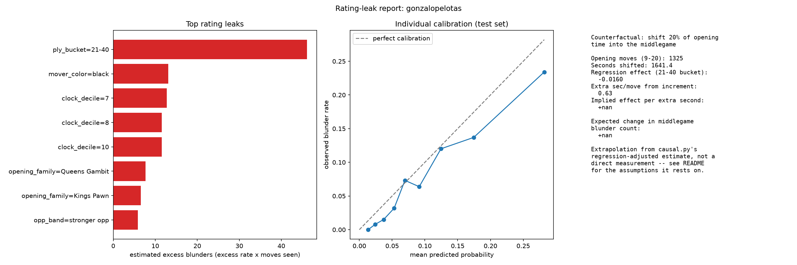
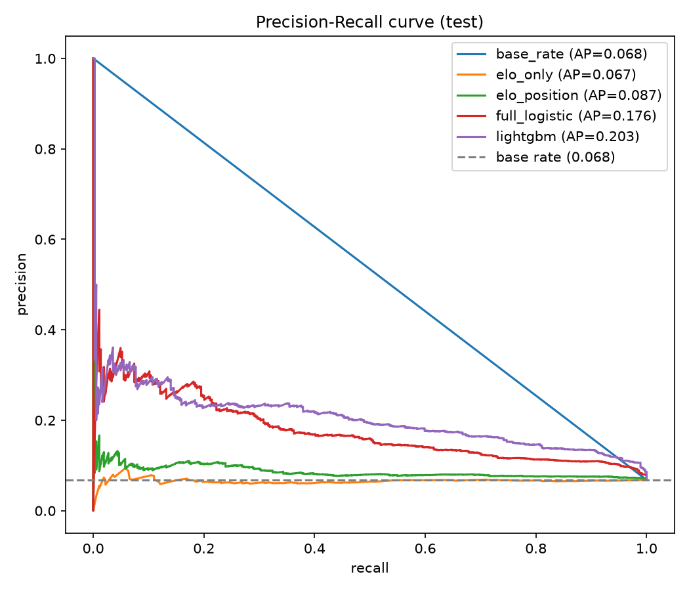
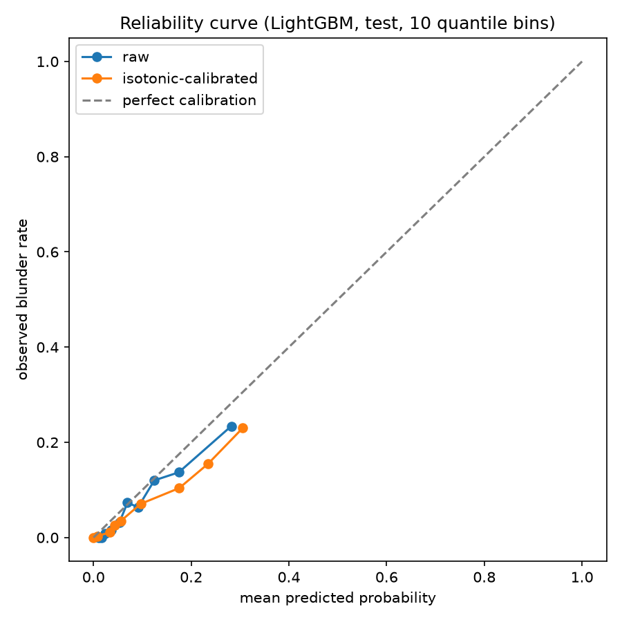
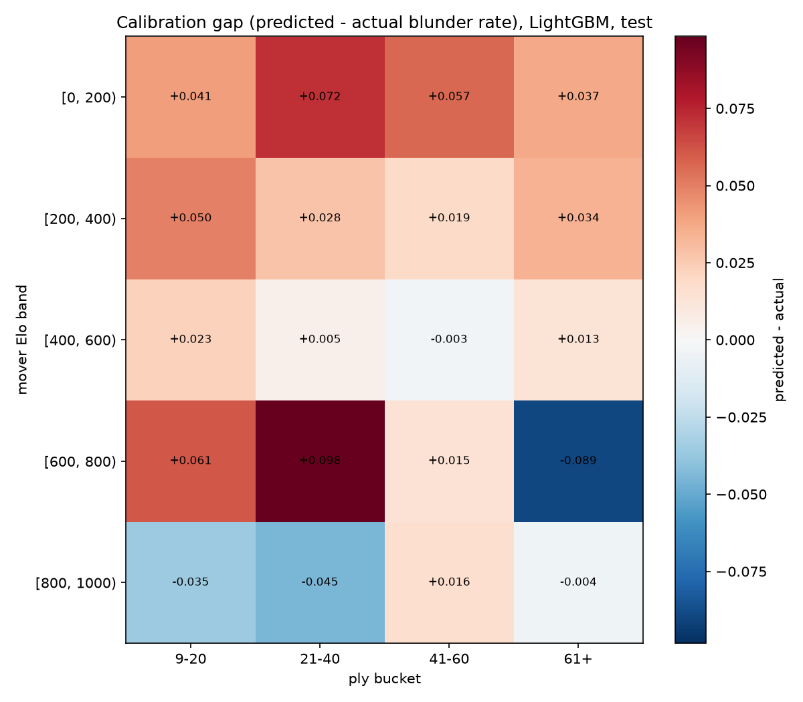
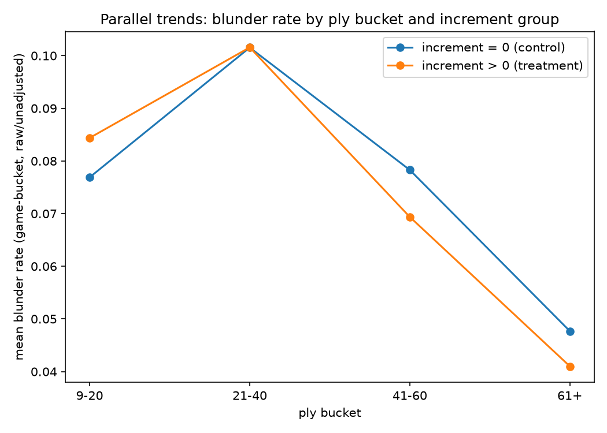
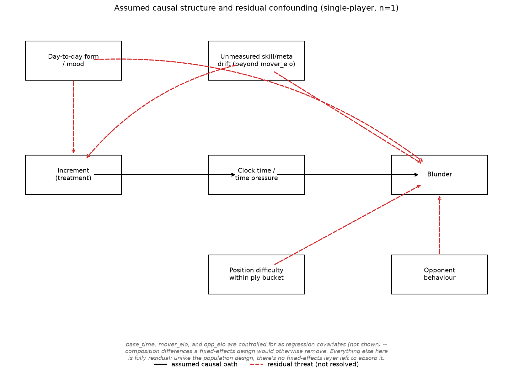
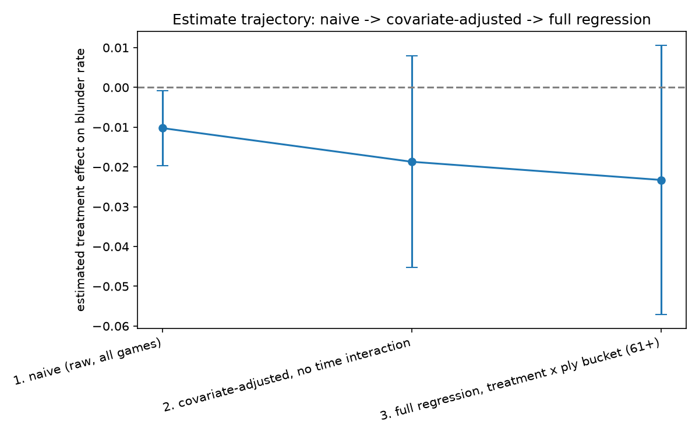

# Chess Rating Leaks & Blunder Coach

A personal analytics pipeline over my own chess.com games (`gonzalopelotas`): where I actually
lose rating points, whether time pressure causes it, and what to do about it.

**[Jump to: Key findings](#at-a-glance) · [Scope](#scope) · [Data](#data-srcingestpy) ·
[Parsing/eval](#move-level-parsing-and-labelling-srcparsepy) ·
[Features/splits](#features-and-splits-srcfeaturespy-srcsplitspy) ·
[Models](#models-and-evaluation-srcmodelspy-srcevaluatepy) ·
[Causal](#increment-as-a-natural-experiment-srccausalpy) ·
[Rating-leak report](#rating-leak-report-srcreportpy) ·
[Blunder trainer](#blunder-trainer-srcmotifspy-srctrainerpy) · [Running it](#running-the-pipeline)**

## At a glance

- **18,847** of my own moves analyzed, 738 games (2021-2026), evaluated with local Stockfish
  since chess.com doesn't provide engine eval via its API.
- Overall blunder rate **7.6%** (moves losing 20+ win-probability points).
- A LightGBM model beats the base rate 3x on PR-AUC and gets **3.4x lift** in the riskiest decile
  of predicted risk (see [Models](#models-and-evaluation-srcmodelspy-srcevaluatepy)).
- Playing with increment plausibly reduces late-game blunders (E-value 3.32), but the evidence is
  suggestive, not conclusive -- see [Causal](#increment-as-a-natural-experiment-srccausalpy) for
  exactly why, reported honestly rather than oversold.
- **Biggest concrete leak: the 21-40 ply middlegame**, where over half of blunders hang material
  outright -- see the full ranked leak table below.
- Those 300 leak-category blunders are re-analysed with MultiPV Stockfish, sorted into 9
  mistake-pattern groups (hung a piece, missed a fork, back-rank, ...), and turned into an
  interactive [blunder trainer](#blunder-trainer-srcmotifspy-srctrainerpy): replay the real
  game, try to find the move you missed.

<p align="center">
  
</p>

## Scope

This started as a population-scale study (two months of Lichess data, ~15k games each, testing
whether a model trained on one month's players generalises to a different month's players). It's
now the opposite: one player's own games, no population or peer comparison anywhere. Every number
in this project is self-relative -- a slice of my own moves against my own overall average.
That's a deliberate trade: less statistical power, but every finding is directly actionable
("you blunder 2.5x your average rate in the 21-40 ply range") without needing anyone else's data.

Two consequences of that pivot run through the whole pipeline and are worth stating up front
rather than discovering three sections down:

- **No Elo-population signal.** In the original design, Elo varied *across* many different
  players and was a strong predictor of blunder risk. Here, `mover_elo` is one player's own
  rating drifting across ~5 years -- a much noisier, weaker signal (the model ladder below finds
  it's not even better than the base rate on its own). Time/era drift, not skill-population
  variation, is what it's mostly picking up.
- **No player fixed effects.** The causal design (Set 5) originally identified the increment
  effect via fixed effects across many "switcher" players. With n=1 player, that collapses to a
  constant. The natural analogue -- day fixed effects, restricted to days this player used both
  settings -- turned out not to be viable either (checked empirically, not assumed: see Set 5).
  The causal estimate here is real, but it's weaker evidence than the original design's.

## Data (`src/ingest.py`)

Source: chess.com's public games-export API
(`api.chess.com/pub/player/gonzalopelotas/games/{year}/{month}`), unauthenticated -- unlike the
original Lichess/HuggingFace pull, this needs no access token at all.

**chess.com never exposes engine `[%eval]` via this API, even for games "Game Review" was run
on** -- verified across all 972 of this player's games spanning 2021-2026 before committing to
this design: zero carry `[%eval]`, 923 carry `[%clk]`. So unlike the original design, eval isn't
filtered on or extracted from the PGN at all; `parse.py` generates it with a local Stockfish
instance instead (see below).

### Filters applied

A game is kept only if: `rules == "chess"` (no variants), `time_class != "daily"` (correspondence
games don't fit a clock-pressure study), `rated` (so Elo means something), `movetext` contains
`[%clk]`, and it wasn't abandoned. Termination and per-side outcome ("timeout", "resigned",
"abandoned", ...) come from chess.com's own structured per-side result codes, not from parsing
free-text strings the way the Lichess `Termination` field required.

**738 of 972 games survive.** Time-control breakdown after filtering: `180+2` (474 games) heavily
dominates; the only genuinely *balanced* matched pair (same base time, increment vs. none) is
**300 / 300+5** (31 / 28 games) -- `180`/`180+2` looked like the obvious pair by raw volume, but
almost all of this player's zero-increment `180` games turn out to be unrated casual games and
get filtered out, leaving only 3 survivors against 474. Checking real survivor counts before
picking a design (rather than assuming the most common time control is the right one) is what
caught this -- see Set 5 for why even the balanced pair isn't enough on its own, either.

### Output

`data/raw/games_gonzalopelotas.parquet`, 738 rows: `game_id`, `white`, `black`, `white_elo`,
`black_elo`, `time_control`, `result`, `termination`, `utc_date`, `end_time` (Unix epoch, used
for the causal day-level grouping), `opening`, `movetext`.

## Move-level parsing and labelling (`src/parse.py`)

Each game is replayed with `python-chess`. Since there's no `[%eval]` to parse, **every position
along the mainline is evaluated with a local Stockfish 19 instance** (`chess.engine`, depth 14).
Each worker process in the multiprocessing pool launches one persistent engine and reuses it
across every game/position it handles -- launching Stockfish per-position would dominate runtime.
The pass is checkpointed by 50-game batch (mirroring the original `ingest.py`'s resumability
philosophy), since this is now the expensive step rather than parsing being nearly free: the full
run over 738 games (~19k evaluated positions) took about 11 minutes on 16 cores.

Annotation semantics are otherwise unchanged from the original design: `eval_after` is the eval
on ply `t`, `eval_before` is the eval on ply `t-1`; the mover's clock before ply `t` is their own
last update on ply `t-2`, not `t-1` (the opponent's). `blunder = wp_loss >= 20` by default,
computed the same win-probability-conversion way as before.

**Only this player's own moves are emitted** -- not both colors, since there's no population
anymore and the whole project is about this one player's decisions. One side effect worth naming:
`wp_volatility_3` (rolling std of the last 3 `wp_before` values) now spans the player's last 3
*own* moves, not 3 raw plies alternating between both players the way it did in the population
design -- an intentional consequence of dropping the opponent's rows, not a bug.

Also handled here, unlike the Lichess-based original: chess.com clocks carry fractional seconds
(`0:03:01.4`, not whole seconds), and `TimeControl` omits `+0` for zero increment (`"600"`, not
`"600+0"`).

Free from the same `engine.analyse()` call already needed for eval: each row also stores the
engine's suggested move both before the player's move (`engine_pv_before`) and after it
(`engine_pv_after`, the opponent's best reply to what was actually played). `report.py` uses the
latter to coarsely tag blunders that hang material outright.

### Output

`data/processed/moves_gonzalopelotas.parquet` -- **18,847 move rows**, overall blunder rate
**7.59%**, mean `wp_loss` 5.04.

## Features and splits (`src/features.py`, `src/splits.py`)

### Leakage rules

Unchanged from the original design -- every feature must be computable strictly *before* the
move is played, and `features.py` asserts `BANNED_COLUMNS.isdisjoint(FEATURE_COLUMNS)` at build
time rather than relying on code review to catch a leaked column. See the original rule list:
no `eval_after`/`cp_after`/`wp_after`/`wp_loss`, no game result/termination, no whole-game
aggregates, and rolling features only look backwards within the same game.

### Splits (`src/splits.py`)

No more `MONTH_A`/`MONTH_B` population split. Instead, a **chronological split exploiting a real
gap in this player's own history**: this player's games cluster into a thin 2021 fragment, a
dense 2023-03..2023-11 block (611 of 738 games), then a ~9-month gap before play resumes in
2024-08 and continues through 2026. Train/val = everything through 2023; **test = everything from
2024-08 onward** -- a longer, more real temporal-generalisation test than the original design's
"≥3 months apart" rule: does a model (and the causal estimate) fit on 2021-2023 play generalise to
how this player plays 9+ months later. Train/val split within that pool stays 80/20 by a hash of
`game_id`, unchanged logic from the original design.

No `test_unseen_players` split -- "generalises to unseen players" isn't a meaningful question for
one player's own games.

### Output

`train` (10,879 rows, blunder rate 7.53%), `val` (2,635 rows, 9.37%), `test` (5,333 rows, 6.83%,
dates 2024-08-01 to 2026-09-07).

## Models and evaluation (`src/models.py`, `src/evaluate.py`)

Model ladder, calibration methodology, and metrics are all unchanged from the original design
(no resampling; base rate / Elo-only / Elo+position / full logistic / LightGBM, all reported side
by side; isotonic calibration fit on val and applied to test; PR-AUC as the primary metric,
always alongside the base rate it's relative to). What changed is what the numbers say, given the
single-player scope:

| split | model | PR-AUC | base rate | ROC-AUC | Brier | lift (top decile) |
|---|---|---|---|---|---|---|
| test | base_rate | 0.068 | 0.075 | 0.500 | 0.0636 | 1.57 |
| test | elo_only | 0.067 | 0.075 | 0.481 | 0.0639 | 1.10 |
| test | elo_position | 0.087 | 0.075 | 0.573 | 0.0642 | 1.57 |
| test | full_logistic | 0.176 | 0.075 | 0.752 | 0.0605 | 3.00 |
| test | lightgbm | **0.203** | 0.075 | 0.805 | 0.0590 | **3.41** |

**Elo-only test PR-AUC (0.067) is *not* better than the base rate (0.068)** -- flagged plainly by
`evaluate.py` rather than hidden, and expected given the scope: Elo here is one player's own
rating drifting over 5 years, not population variation, so on its own it's a genuinely weak
signal (a much bigger swing than what population Elo would give). Full board/clock/history
features recover a lot of that (0.176), and LightGBM wins outright (0.203, 3.4x lift in the top
decile) -- board state and clock pressure carry real signal even without a population to learn
from.

<p align="center">
  
  
</p>

**Calibration got slightly worse after isotonic regression on this data** (Brier 0.0590 ->
0.0610) -- the val set used to fit the isotonic map is small (2,635 rows) relative to the
original population design's, so the calibration map itself is noisier here. Reported plainly
rather than cherry-picking a split where it looks better.

Threshold sensitivity (10/15/20/30 win-% points) and the Elo-band x ply-bucket slice heatmap are
otherwise unchanged in method:

<p align="center">
  
</p>

See `outputs/tables/threshold_sensitivity.csv` for the full sweep.

### Output

`outputs/tables/model_comparison.csv`, `outputs/tables/threshold_sensitivity.csv`,
`outputs/tables/slice_heatmap.csv`, `outputs/figures/calibration.png`,
`outputs/figures/pr_curve.png`, `outputs/figures/slice_heatmap.png`, pickled fitted models in
`data/processed/model_{name}.pkl`.

## Increment as a natural experiment (`src/causal.py`)

Setup unchanged from the original design's logic: increment is fixed before a game starts and
can't respond to any specific position, and its effect on the clock only compounds as the game
goes on -- a difference-in-differences structure (unit: game, treatment: increment > 0, "time":
ply bucket, outcome: blunder rate in that game's moves in that bucket).

### What changed, and why (checked empirically)

The original design identified the effect via **player fixed effects across many "switcher"
players**. With one player that collapses to a constant -- no cross-player variation to demean.
The natural single-player analogue is **day fixed effects, restricted to "switch days"** (days
this player used both settings) -- directly targeting the exact confound the original README
flagged as the single most serious residual threat ("switchers may choose increment based on how
they expect to play that day").

That was the plan. `causal.py` checks it empirically before committing to it, and the numbers
rule it out:

```
switch-day diagnostic (days with both a treatment and a control game):
  base=60:  no-inc moves=103,   inc moves=1,026,  switch_days=2/27 days
  base=180: no-inc moves=52,    inc moves=11,995,  switch_days=1/200 days
  base=300: no-inc moves=779,   inc moves=746,     switch_days=0/27 days
```

This player just doesn't switch time controls within short windows -- they play one setting for
a stretch, then another, not both in the same session. Day fixed effects have essentially no
within-day variation left to work with at any matched base time.

**Falls back to regression adjustment instead of fixed effects**: pool every game (not
restricted to one matched pair), and control for `base_time`, `mover_elo`, and `opp_elo` directly
in the regression (`blunder_rate ~ treatment * C(ply_bucket) + C(base_time) + mover_elo +
opp_elo`, cluster-robust SE by game) rather than removing them via demeaning. `mover_elo` absorbs
most of the mechanical confound (this player's Elo, and which time control they favoured, both
drifted a lot across the 2021/2023/2024+ eras). This is a real, honest downgrade in rigor from
the population design's fixed effects, forced by this player's actual play patterns -- day-to-day
form and switcher self-selection go back to being fully residual threats rather than partially
handled ones. Reported as such throughout, not smoothed over.

### Required checks

- **Balance table**: mover Elo is very different by treatment group (652 mean / control vs. 376
  mean / treatment) -- exactly why regression adjustment, not a raw comparison, is necessary.
  `base_time` composition differs sharply too (`outputs/tables/increment_balance_base_time.csv`):
  treatment is overwhelmingly 180s games, control overwhelmingly 600s/300s.
- **Placebo check**: raw earliest-bucket gap +0.0075; the regression-*adjusted* gap (the fitted
  model's own `treatment` coefficient, since the earliest ply bucket is the omitted reference
  category) is -0.0086 (SE 0.0154) -- within the 0.02 tolerance, consistent with parallel trends
  holding once `base_time`/Elo composition is controlled for.

<p align="center">
  
</p>

### DAG and estimate trajectory

Unlike the population design's DAG, there's no fixed-effects layer left to draw as "handled" --
day-to-day form, switcher self-selection, position difficulty within a ply bucket, and opponent
behaviour are all fully residual dashed threats here. A new one this design surfaced empirically:
unmeasured skill/meta drift across eras that `mover_elo` only partially captures (the caption
notes `base_time`/Elo are controlled for as regression covariates instead).

<p align="center">
  
</p>

| step | estimate | SE |
|---|---|---|
| 1. naive (raw, all games) | -0.0102 | 0.0048 |
| 2. covariate-adjusted, no time interaction | -0.0187 | 0.0136 |
| 3. full regression, treatment x ply bucket (61+) | -0.0233 | 0.0173 |

<p align="center">
  
</p>

The estimate grows more negative (more protective) from naive to adjusted to the full
ply-bucket interaction -- consistent with the hypothesis that averaging over the whole game
dilutes a real, compounding effect, though the 95% CI at the latest bucket (-0.057, +0.011)
still includes zero. This is suggestive, not conclusive, evidence -- exactly what the weaker
identification strategy above predicts.

### Sensitivity analysis (E-value)

Total effect at the latest ply bucket: -0.0233 blunder-rate points on a baseline of 0.0477
(implied risk ratio 0.512). **E-value 3.32** for the point estimate, **1.00** for the CI bound
closest to null (i.e. the CI already includes no effect, so no confounding is needed to reach
it there). Read this as an upper bound on rigor, not a guarantee: this is regression adjustment
on observed covariates, not a fixed-effects or switcher design. Day-to-day form and switcher
self-selection -- the confounders this E-value is warning about -- are exactly what this
player's data didn't have enough within-day switching to rule out directly.

### Output

`outputs/tables/increment_balance.csv`, `outputs/tables/increment_balance_base_time.csv`,
`outputs/tables/increment_did_results.csv`, `outputs/tables/increment_sensitivity.csv`,
`outputs/tables/estimate_trajectory.csv`, `outputs/figures/parallel_trends.png`,
`outputs/figures/estimate_trajectory.png`, `outputs/figures/causal_dag.png`,
`data/processed/causal_did_artifacts.pkl`.

## Rating-leak report (`src/report.py`)

No peer/population comparison anywhere (explicit choice) -- every leak is this player's own
moves sliced against their own overall average (6.83% on the test set), which is what makes each
finding actionable without needing other players' data.

Slices across five dimensions already present in the data (opening family, color, ply bucket,
clock decile, opponent-strength band relative to this player's own Elo), each requiring >=20
moves to count. Ranked by `excess_rate x moves_seen` (an estimate of actual excess blunders
accounted for, so a rare-but-severe slice doesn't outrank a frequent-but-moderate one). Each
blunder in a reported slice is also tagged `hangs_material` if the engine's best reply to the
resulting position is itself a capture -- free from the eval calls `parse.py` already made, no
extra engine cost.

**Top leaks found (test set, 2024-08 onward):**

| dimension | value | moves | blunder rate | vs. own avg | est. excess blunders | % hang material |
|---|---|---|---|---|---|---|
| ply_bucket | 21-40 | 1,830 | 9.3% | +2.5pp | 46.1 | 53% |
| mover_color | black | 2,343 | 7.4% | +0.6pp | 13.1 | 52% |
| clock_decile | 7 | 531 | 9.2% | +2.4pp | 12.8 | 45% |
| clock_decile | 8 | 534 | 9.0% | +2.2pp | 11.6 | 42% |
| clock_decile | 10 (least time) | 534 | 9.0% | +2.2pp | 11.6 | 54% |
| opening_family | Queens Gambit | 136 | 12.5% | +5.7pp | 7.7 | 59% |
| opening_family | Kings Pawn | 138 | 11.6% | +4.8pp | 6.6 | 69% |
| opp_band | stronger opponents | 617 | 7.8% | +1.0pp | 5.9 | 58% |

The biggest single leak by far is the middlegame (21-40 plies) -- over half of those blunders
hang material outright rather than losing to a subtler idea, which points at a concrete fix (a
deliberate blunder-check habit before moving) rather than "study more." Low-clock-time deciles
show up three times in the top 8, consistent with Set 5's finding that time pressure has a real
(if not fully pinned-down) effect. (Full figure at the top of this README.)

### Counterfactual

Mechanically unchanged from the original design: extrapolates Set 5's regression-adjusted
middlegame effect to "what if I shifted 20% of my opening time into the middlegame," using the
empirical extra-seconds-per-move increment buys as the conversion bridge. On this player's data,
that bridge (`bucket_time_diff` in `causal.py`, itself regression-adjusted for `base_time` for
the same reason the main effect is -- an unadjusted version came out with the wrong sign entirely,
since treatment/control differ so much in `base_time` composition) comes out to **+0.63
seconds/move** in the middlegame bucket, below the 1-second reliability floor -- so the
counterfactual is correctly reported as unavailable rather than as a number that looks precise
but isn't (an earlier, un-adjusted version of this bridge produced a nonsense "+19 expected
blunders," which is what surfaced the base_time-adjustment bug in the first place).

### LLM coaching narrative

Optional: if `GROQ_API_KEY` is set (free, no credit card -- get one at console.groq.com),
`report.py` sends the ranked leak table and the causal finding to `openai/gpt-oss-120b` via Groq
and writes a short, direct, plain-English improvement plan to `outputs/coaching_narrative.md` --
addressed to the player, specific enough to act on this week, and honest about what's working as
well as what isn't. `ANTHROPIC_API_KEY` works too (Claude instead of the Groq model) if set and
`GROQ_API_KEY` isn't -- that one's paid, not free, so Groq is the default. If neither key is set,
this step is skipped and the numeric leak table/figure are unaffected.

> *Sample output, generated from the table above:* "The biggest leak is the middlegame (21-40)
> where more than half your losses are outright hung pieces, not deep tactics -- a deliberate
> blunder-check habit before moving would fix most of this on its own. You're also clearly
> feeling the clock: three of your worst deciles are the lowest-time ones, so budgeting more time
> earlier (or leaning on increment more) is worth more than pure study..." (full text in
> `outputs/coaching_narrative.md` after you run it with a key set).

### Output

`outputs/tables/rating_leaks.csv`, `outputs/figures/player_report_gonzalopelotas.png`,
`outputs/coaching_narrative.md` (if `GROQ_API_KEY` or `ANTHROPIC_API_KEY` is set).

## Blunder trainer (`src/motifs.py`, `src/trainer.py`)

`report.py` says *which slices* leak rating points. This pair goes one level down: it takes
every blunder that falls in one of those leak slices, works out *what kind of mistake* it was,
groups them by pattern, and builds an interactive page to drill them against the real games.
The point is that what's learnable is the motif, not the exact position -- two positions that
look nothing alike but where you walked into a knight fork both times belong together.

### Motif tagging (`src/motifs.py`)

The **300** test-set blunders that land in a ranked leak slice are re-analysed with a local
Stockfish at **MultiPV=3, depth 16** from the pre-move position, plus a depth-14 single-PV
look at the position *after* the move actually played (for the refutation). From that, each
blunder gets:

- **`acceptable_moves`** -- every reply within 40 cp of the engine's best (mover POV). This is
  what the trainer accepts as "you found it". Deliberately strict: with only 3 PVs a genuinely
  fine 4th move can be marked "not best", so the trainer always shows the top-3 lines with
  their evals on reveal, not just a verdict.
- **`material_label`** -- most negative swing in the mover's own material over the first few
  plies of the refutation: hung a queen / rook / piece, lost the exchange, dropped a pawn, or
  none (positional).
- **`refutation_type`** -- `allowed_mate`, `back_rank`, `fork` (the reply lands a piece
  attacking two of the mover's pieces), `capture`, `check`, or `quiet`.
- **`advantage_state`** -- from `wp_before`: threw away a winning position / lost from equal /
  compounded a worse one.

`motif_group` is the highest-priority tag present (`allowed_mate` > `back_rank` > `fork` >
hung queen/rook/piece > lost exchange/pawn > positional):

| motif group | n | mean win-% lost | were winning first |
|---|---|---|---|
| Hung a piece | 84 | 38 | 64% |
| Positional slip (no material) | 67 | 31 | 55% |
| Hung the queen | 38 | 50 | 66% |
| Missed a fork | 36 | 40 | 56% |
| Dropped a pawn | 32 | 36 | 59% |
| Hung a rook | 23 | 38 | 57% |
| Allowed forced mate | 14 | 54 | 50% |
| Back-rank tactic | 4 | 45 | 50% |
| Lost the exchange | 2 | 40 | 50% |

**These are heuristics off a shallow line, not a tactics solver** -- they're for grouping, not
for teaching tactics on their own; the module docstring says so too. Engine access is an
injected callable (same pattern as `parse.py`), so `tests/test_motifs.py` runs the
classification logic against a deterministic fake with no Stockfish binary.

Output: `data/processed/blunder_motifs_gonzalopelotas.json` (nested per-blunder records --
JSON, not parquet, because of the nested move lists), `outputs/tables/blunder_motifs.csv`
(flattened, for eyeballing).

### The trainer page (`src/trainer.py`)

Builds one self-contained HTML page from that JSON plus the raw game movetext. Per blunder:
step through the last few moves of lead-up, then find the move on the board; on any legal move
it reveals whether you found a top engine move, the move you actually played, the top-3 engine
lines, your clock at that moment, and a link to replay the whole game on chess.com. Puzzles
are grouped by motif with per-group progress; solved/attempted state is kept per-device in
`localStorage`. The page loads only `chess.js` (move legality) from a CDN -- board, pieces and
all data ship inline -- so it publishes cleanly as an Artifact and also opens as a local file.

**Live trainer: https://claude.ai/code/artifact/8059200a-0b59-4682-a005-78f13df541d6**

Output: `outputs/trainer/blunder_trainer.html`.

## Running the pipeline

Requires Stockfish on `PATH` (`winget install --id Stockfish.Stockfish -e` on Windows) and the
packages in `requirements.txt`. No API token needed for ingestion (unlike the original
HF-dataset design). In order:

```
python src/ingest.py     # pulls chess.com games -> data/raw/
python src/parse.py      # Stockfish eval pass -> data/processed/moves_gonzalopelotas.parquet
python src/features.py   # -> data/processed/features_gonzalopelotas.parquet
python src/splits.py     # -> data/processed/{train,val,test}.parquet
python src/evaluate.py   # fits + evaluates the model ladder -> outputs/
python src/causal.py     # increment natural experiment -> outputs/
python src/report.py     # rating-leak report -> outputs/ (set GROQ_API_KEY for the narrative)
python src/motifs.py     # MultiPV re-analysis of leak-category blunders -> data/processed/blunder_motifs_gonzalopelotas.json
python src/trainer.py    # -> outputs/trainer/blunder_trainer.html  (then publish it as an Artifact)
```

`pytest tests/` covers `parse.py`'s off-by-one alignment logic and `motifs.py`'s blunder
classification, both via injected fake evaluators, so the suite doesn't depend on the real
Stockfish binary being installed.
